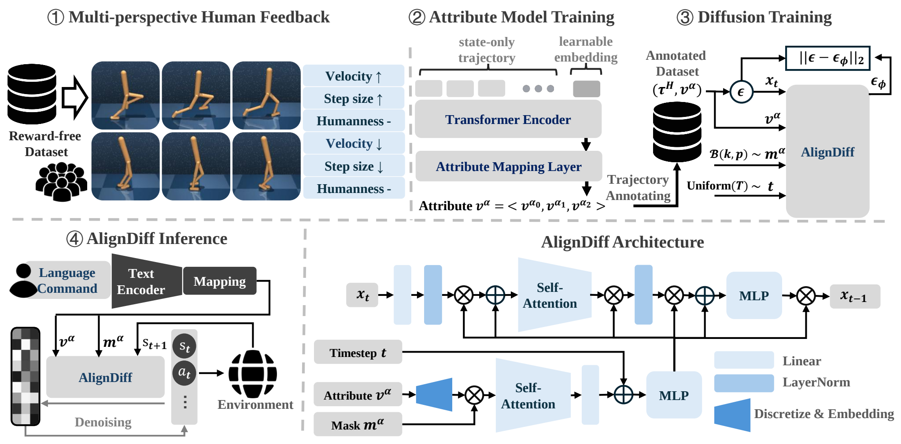

# AlignDiff: Aligning Diverse Human Preferences via Behavior-Customisable Diffusion Model (ICLR 2024)

(See more visual examples on the [Project Page](https://aligndiff.github.io/))

Official python implementation of the ICLR 2024 paper: [AlignDiff: Aligning Diverse Human Preferences via Behavior-Customisable Diffusion Model](https://openreview.net/forum?id=bxfKIYfHyx&referrer=%5Bthe%20profile%20of%20Fei%20Ni%5D(%2Fprofile%3Fid%3D~Fei_Ni1)).

## Download datasets and pretrained models

The training datasets for Hopper/Walker/Humanoid can be downloaded from this [OneDrive Link](https://1drv.ms/u/s!AolpT7J0JGi6xFpH_E8uxQVE79WK?e=1unIaq). After downloading, please unzip the file to the root directory.
```bash
.
└── datasets
    ├── behaviors
    │   └── [task].hdf5 # state-action trajectory datasets for various behaviors.
    └── feedbacks
        └── [task]_[label_type]_[train_or_eval].hdf5 # pairwise trajectory evaluation feedback. [label_type] can be 'syn' for synthetic labels and 'hum' for human feedback labels.
```

Pre-trained models on `syn` labels can be downloaded from this [OneDrive Link](https://1drv.ms/u/s!AolpT7J0JGi6xFlV5h1VcE3ufbUd?e=vXGJwc). After downloading, please unzip the file to the root directory. 

```bash
.
├── datasets
│   └── attr_label
│       └── [task]_[label_type].hdf5 # labels given by pre-trained attribute models.
└── results
    ├── attr_func
    │   └── [task]_[label_type].hdf5 # pre-trained transformer-based attribute models.
    ├── diffusion
    │   └── [task]_[label_type].hdf5 # pre-trained diffusion models.
    └── evaluation
        └── [task]_[label_type]_[seed].hdf5 # test logs for pre-trained models.
```

## Quick Start
```bash
python train_attr_func.py --task walker --label_type syn  --device [YOUR_DEVICE]
python train_diffusion_model.py --task walker --label_type syn --device [YOUR_DEVICE]
python eval.py --task walker --label_type syn --device [YOUR_DEVICE]
python plot.py --task walker
```

## Citation
```bash
@inproceedings{dong2024aligndiff,
title={AlignDiff: Aligning Diverse Human Preferences via Behavior-Customisable Diffusion Model},
author={Zibin Dong and Yifu Yuan and Jianye HAO and Fei Ni and Yao Mu and YAN ZHENG and Yujing Hu and Tangjie Lv and Changjie Fan and Zhipeng Hu},
booktitle={The Twelfth International Conference on Learning Representations, {ICLR}},
year={2024},}
```

Note: The code has been refactored for better readability and improved performance. If you encounter any problems, feel free to email zibindong@outlook.com. In this new implementation, despite not carefully tuning the hyperparameters, the diffusion sampling steps for the Hopper/Walker/Humanoid tasks have been reduced to just 5 steps, achieving sufficiently good performance compared to the suggested 10/10/20 steps in the paper. The performance for the three tasks are as follows: $0.652\pm0.009$, $0.638\pm0.023$, $0.312\pm0.011$. Both Hopper and Walker outperform the results reported in the paper, while Humanoid, although slightly lower, has improved decision speed by 4 times.